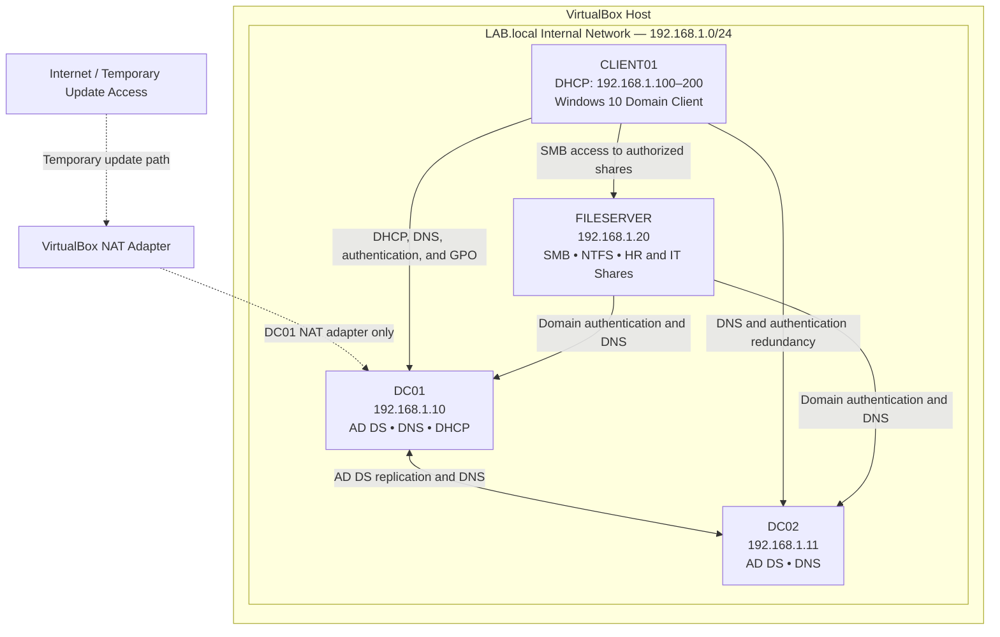

<h1 align="center">Enterprise Active Directory & Security Operations Lab</h1>

<h2>Project Summary:</h2>

Designed and implemented a multi-phase enterprise Active Directory lab simulating real-world IT operations, including system administration, network services, security hardening, automation, and troubleshooting.

This project demonstrates:
- Deployment of two domain controllers (DC01 and DC02) to demonstrate directory-service redundancy and replication.
- Centralized identity and access management using Active Directory.
- Network services configuration (DNS, DHCP) for domain functionality.
- Organizational Unit (OU) design and user provisioning.
- Group Policy enforcement to control user and system behavior.
- File server configuration with NTFS and share permissions using least privilege.
- PowerShell automation for bulk user provisioning and administrative efficiency.
- Security hardening and monitoring using account policies and event logging.
- Troubleshooting and help desk simulation using real-world IT scenarios and tools.

This lab simulates responsibilities across System Administration, IT Support, and Security Operations roles.

<h2>Description:</h2>
This project simulates a real-world enterprise IT environment using a Windows Server–based Active Directory infrastructure. The lab was designed to demonstrate core system administration skills, including identity and access management, network services configuration, automation, security hardening, and troubleshooting.

<h2 align="center">Technologies and Tools Used:</h2>

<div align="center">
 
<b>`Directory and Identity Services:`</b>

Active Directory Domain Services (**`AD DS`**).<br>
Active Directory Users and Computers (**`ADUC`**).<br>
Group Policy Management.<br>

<b>`Networking Services:`</b>

DNS.<br>
DHCP.<br>
TCP/IP IPv4 Addressing.<br>
Static IP Configuration.<br>
VirtualBox Internal Networking.<br>

<b>`File Services & Access Control:`</b>

File Server.<br>
SMB Sharing.<br>
NTFS Permissions.<br>
Group Policy Objects.<br>

<b>`Scripting and Tools:`</b>

PowerShell.<br>
</div>

<h2 align="center">Key Skills Demonstrated:</h2>

<div align="center">

`Active Directory Administration` (**AD DS**).<br>
`Group Policy Management` (**GPOs**).<br>
`DNS & DHCP Configuration.`<br>
`Identity & Access Management` (**IAM**).<br>
`Virtual Network Design & Service Integration.`<br>
`Windows Server Administration.`<br>
`PowerShell` (**Basic Automation**).<br>

</div>

<h2>Environments Used:</h2>

- VirtualBox.
- Windows 10 Client (**`21H2`**).
- Windows Server 2022.


<a id="network-diagram"></a>
<h2 align="center">Network Diagram</h2>

The lab uses one isolated VirtualBox internal network for domain traffic. DC01 also has a separate NAT adapter that was used only for temporary package and update access. DC01 was not configured as a router for the internal clients.



| System | Addressing | Primary Roles |
|---|---|---|
| `DC01` | Static `192.168.1.10/24` | First domain controller, AD DS, DNS, DHCP |
| `DC02` | Static `192.168.1.11/24` | Additional domain controller, AD DS, DNS, replication |
| `FILESERVER` | Static `192.168.1.20/24` | Domain member, SMB shares, NTFS permissions |
| `CLIENT01` | DHCP scope `192.168.1.100–192.168.1.200` | Windows 10 domain client and access-testing workstation |

> **Design note:** No default gateway was assigned to the isolated internal network because the lab did not include a router. The separate NAT adapter on DC01 was retained only for temporary administrative update access.

<h2>Table of Contents</h2>

- [Network Diagram](#network-diagram)
- [Phase I: Environment Setup](#phase-i)
- [Phase II: Organizational Unit Design & User Provisioning](#phase-ii)
- [Phase III: Group Policy Management](#phase-iii)
- [Phase IV: File Server & Permissions](#phase-iv)
- [Phase V: DHCP Validation & Automated Client Addressing](#phase-v)
- [Phase VI: PowerShell-Based Active Directory User Provisioning](#phase-vi)
- [Phase VII: Security Hardening, Auditing & Event Monitoring](#phase-vii)
- [Project Completion Summary](#project-completion)

<h2 align="left">Lab Walk-Through</h2>

--------
<a id="phase-i"></a>
<h2 align="center"><strong>Phase I: Environment Setup</strong></h2>

--------

<b>`Active Directory Purpose & Key Concepts:`</b>
- A domain controller is a critical system in enterprise networks, responsible for authentication, authorization, and policy enforcement.
- Active Directory provides centralized identity and access management.
- A domain controller hosts Active Directory and handles authentication and security policies across the network.
- Active Directory manages authentication, passwords, logins, users, groups, and computers, and controls access through permissions and group policies.
- Group Policy Objects enforce security settings and system configuration.
- Active Directory also supports least privilege access to protect network resources.

<b>`Lab Overview:`</b>

This lab focuses on building a functional Active Directory environment by configuring two domain controllers (DC01 and DC02) within an isolated network. Core services, including AD DS, DNS, and DHCP, were installed and configured. DC01 was deployed as the first domain controller and network-services host, while DC02 was promoted as an additional domain controller to provide directory-service redundancy and replication. The setup was validated by verifying DNS resolution, Active Directory functionality, and successful replication between the domain controllers.

**`Design Decisions:`**
- Implemented two domain controllers to demonstrate directory-service redundancy and replication in an enterprise-style environment.
- Separated temporary NAT-based update access from internal domain traffic to maintain an isolated lab network.
- Used static IP addressing to ensure consistent communication for critical infrastructure services.
- Configured DNS and replication to maintain directory consistency across domain controllers.

<h3 align="center">Server Setup & Domain Controller Configuration:</h3>

**`Step 1:`**
<p align="center"> <strong>Configuring DC01 Network Adapters:</strong> </p>
<p align="center">
  
  &nbsp;&nbsp;&nbsp;&nbsp;
  
</p>
<p align="center"> <strong>Configuring DC02 Network Adapter:</strong> </p>
<p align="center">
  
</p>

**`Network Services Configuration:`**

DC01 was configured with separate NAT and internal adapters so the isolated domain network could remain separate from temporary update access. DC02 operated only on the internal network to support authentication and replication without direct NAT connectivity.

This design was used for lab functionality. In a production environment, routing and external connectivity would normally be handled by dedicated network infrastructure rather than directly by a domain controller.
<br>

**`Step 2:`**
<p align="center"> <strong>Configuring DC01 and DC02 with a Static IP Address:</strong> </p>
<p align="center">
  
  &nbsp;&nbsp;&nbsp;&nbsp;
  
</p>

**`Assigning Static IP Configuration:`**

In this step, static IP addresses were configured on both domain controllers (DC01 and DC02) to ensure consistent and reliable network communication within the lab environment. 
- DC01 was assigned **192.168.1.10** and DC02 was assigned **192.168.1.11**, both using a subnet mask of **255.255.255.0**. 
- **No default gateway** was configured since the internal network is isolated. 
- DNS settings were configured to support Active Directory, with DC02 pointing to DC01 as its primary DNS server.

Using static IPs is critical in a domain environment to prevent IP changes that could disrupt services like DNS and authentication.
<br>

**`Step 3:`**
<p align="center"><strong>Renaming the Server:</strong></p>
<p align="center"><strong>Renaming Server to DC01 and DC02:</strong></p>
<p align="center">
  
  &nbsp;&nbsp;&nbsp;&nbsp;
  
</p>

**`Server Renaming and Initial Configuration:`**

Both servers were renamed to DC01 and DC02 to align with standard enterprise naming conventions for domain controllers. This ensures clarity in role identification, simplifies management, and supports easier troubleshooting within the environment.
<br>

**`Step 4:`**
<p align="center"><strong>Install Roles (AD DS, DNS, DHCP):</strong></p>
<p align="center">
  
  &nbsp;&nbsp;&nbsp;&nbsp;
  
</p>

**`Active Directory and Core Services Installation:`**

Core infrastructure roles were installed to support the Active Directory environment. DC01 was configured with Active Directory Domain Services (AD DS), DNS, and DHCP as the first domain controller and network-services provider. DC02 was configured with AD DS and promoted as an additional domain controller to support directory-service redundancy and replication.
<br>

**`Step 5:`**
<p align="center"><strong>Promote to Domain Controller:</strong></p>
<p align="center"><strong>DC01 Promotion:</strong></p>
<p align="center">
  
</p>
<p align="center"><strong>DC02 Promotion:</strong></p>
<p align="center">
  
  &nbsp;&nbsp;&nbsp;&nbsp;
  
</p>

**`Domain Controller Promotion:`**

DC01 was promoted as the first domain controller by creating the new `LAB.local` Active Directory forest. DC02 was then joined to the domain and promoted as an additional domain controller to provide directory-service redundancy and Active Directory replication.

This configuration demonstrates replication and service redundancy within the virtual lab. Because both virtual machines run on the same physical host and virtual network, it should not be treated as production-level high availability or fault tolerance.
<br>

**`Step 6:`**
<p align="center"><strong>Verify Active Directory + DNS / Replication:</strong></p>
<p align="center"><strong>DC01 Verification:</strong></p>
<p align="center">
  
  &nbsp;&nbsp;&nbsp;&nbsp;
  
</p>
<p align="center"><strong>DC02 Verification:</strong></p>
<p align="center">
  
  &nbsp;&nbsp;&nbsp;&nbsp;
  
</p>

**`Active Directory and Replication Verification:`**

Post-deployment validation was performed to confirm proper Active Directory functionality. DNS configuration was verified through forward lookup zones, and replication health between DC01 and DC02 was validated using tools such as `repadmin` and Active Directory Sites and Services.

Successful replication confirmed directory consistency and proper communication between domain controllers.
<br>

**`Step 7:`**
<p align="center"><strong>Configure DHCP:</strong></p>
<p align="center">
  
  &nbsp;&nbsp;&nbsp;&nbsp;
  
</p>
<p align="center">
  
  &nbsp;&nbsp;&nbsp;&nbsp;
  
</p>
<p align="center">
  
</p>

**`DHCP Configuration:`**

A DHCP scope was configured to automate IP address assignment for client systems within the domain. The scope range (**192.168.1.100–192.168.1.200**) was defined to separate client devices from infrastructure systems.

DNS settings were configured to point to the internal domain controllers, ensuring proper name resolution and domain connectivity. The DHCP server was authorized in Active Directory before it issued leases to domain clients.

This setup enables centralized network management and reduces manual configuration for client devices.
<br>

**`Step 8:`**
<p align="center"><strong>Disable DNS Registration on the NAT Adapter:</strong></p>
<p align="center">
  
</p>
<p align="center"><strong>Configure DNS on DC02:</strong></p>
<p align="center">
  
</p>

**`DNS Optimization and Configuration:`**

DNS settings were refined to prevent conflicts and support accurate internal name resolution. DNS registration was disabled on DC01's NAT adapter so that the external-facing address would not be registered in the `LAB.local` zone. After promotion, the domain controllers used the internal DNS services hosted on DC01 and DC02.

For the configuration shown in this lab:
- Preferred DNS: **192.168.1.10**
- Alternate DNS: **192.168.1.11**

Name-resolution testing confirmed that both domain controllers could resolve the required internal records.
<br>

**`Step 9:`**
<p align="center"><strong>Test DC01:</strong></p>
<p align="center">
  
  &nbsp;&nbsp;&nbsp;&nbsp;
  
</p>

**`System Validation and Testing:`**

Network and domain functionality were validated using tools such as `ipconfig` and `nslookup` to confirm correct IP configuration and DNS resolution.

Successful testing verified that the domain environment was fully operational and that systems could communicate and resolve domain resources correctly.
<br>

**`Key Tasks Completed:`**
- Built a two-domain-controller architecture (DC01 and DC02) to demonstrate Active Directory replication and directory-service redundancy.
- Separated NAT-based update access from the isolated internal domain network for lab management and testing.
- Implemented static IP addressing for critical systems to ensure consistent DNS resolution and reliable domain communication.
- Deployed Active Directory Domain Services (AD DS), DNS, and DHCP to establish core identity and network services.
- Built a new Active Directory forest (**`LAB.local`**) and promoted DC01 as the first domain controller.
- Integrated and promoted DC02 as an additional domain controller to support redundancy and directory replication.
- Configured DNS for multi-DC support, ensuring accurate name resolution and service reliability.
- Validated AD health and replication using tools such as **`repadmin`** and Active Directory Sites and Services.
- Configured and authorized DHCP with a defined scope (**`192.168.1.100–200`**) to automate client IP assignment.
- Optimized network configuration by disabling DNS registration on external interfaces to prevent conflicts.
- Performed system validation using **`ipconfig`**, **`nslookup`**, and **`repadmin`** to confirm network configuration, DNS resolution, and Active Directory replication.

**`Overview:`**

This phase focused on building the core Active Directory infrastructure by configuring two domain controllers (DC01 and DC02) within an isolated network. Key services such as AD DS, DNS, and DHCP were installed, with DC01 serving as the first domain controller and DC02 serving as an additional domain controller for replication and directory-service redundancy. The setup was validated through DNS resolution, replication checks, and successful domain functionality testing.
<br>

--------

<a id="phase-ii"></a>
<h2 align="center"><strong>Phase II: Organizational Unit (OU) Design & User Provisioning</strong></h2>

--------

**`Objective:`**
Design and implement an Organizational Unit structure and provision users to support scalable identity management.

**`Key Concepts:`** 
-  OU design follows business structure, such as departments, roles, or locations.
-  User provisioning includes creating and configuring user accounts with the correct attributes and settings.
-  Security groups are used to assign permissions and control access to resources.
-  OU structure supports delegation of administration and simplifies policy application through Group Policy Objects.

<b>`Lab Overview:`</b>

This lab focuses on designing a structured Active Directory environment by creating Organizational Units (OUs) for departments such as HR, IT, and Finance, and provisioning users within each group. A hierarchical OU model was implemented to mirror a real-world enterprise and support scalable management. The setup was validated by joining a Windows client to the LAB.local domain and confirming successful authentication using domain accounts.

<h3 align="center">Active Directory Infrastructure Setup:</h3>

**`Step 1:`**
<p align="center"><strong>Creating OUs:</strong></p>
<p align="center">
  
  &nbsp;&nbsp;&nbsp;&nbsp;
  
</p>
<p align="center">
  
  &nbsp;&nbsp;&nbsp;&nbsp;
  
</p>

**`Organizational Unit (OU) Design:`**

A hierarchical Organizational Unit structure was created to reflect a real-world enterprise environment. A parent "Company" OU was established, with child OUs for departments such as HR, IT, and Finance.

This structure supports scalable management, delegation of administrative control, and targeted Group Policy application.
<br>

**`Step 2:`**
<p align="center"><strong>Creating Departmental OU Users:</strong></p>
<p align="center">
  
  &nbsp;&nbsp;&nbsp;&nbsp;
  
</p>
<p align="center">
  
</p>

**`User Provisioning:`**

User accounts were created within each departmental OU to simulate real-world identity management. This approach ensures users are logically organized and allows policies and permissions to be applied based on department.

Standardized naming conventions were used to maintain consistency and support easier administration.
<br>

**`Step 3:`**
<p align="center"><strong>Domain Integration of a Windows Client with Active Directory</strong></p>
<p align="center">
  
  &nbsp;&nbsp;&nbsp;&nbsp;
  
</p>

**`Client Domain Integration:`**

A Windows 10 client machine was joined to the LAB.local domain to validate domain functionality. DNS was configured to point to the domain controller, ensuring proper domain resolution.

Successful login using domain credentials confirmed proper authentication and integration with Active Directory.

**`Key Tasks Completed:`**
- Designed and implemented a hierarchical Organizational Unit (OU) structure aligned with departmental functions (**`HR, IT, Finance`**) to support scalable identity management.
- Structured Active Directory objects to enable efficient policy application, delegation, and administrative organization.
- Provisioned user accounts within departmental OUs using standardized naming conventions to ensure consistency and manageability.
- Applied logical grouping of users and resources to support role-based access control (RBAC) principles.
- Demonstrated understanding of Active Directory object types and relationships (**`users, groups, OUs`**).
- Integrated a Windows 10 client into the domain environment to simulate enterprise endpoint management.
- Configured client DNS settings to ensure proper domain resolution and authentication.
- Validated successful domain authentication through user login testing across multiple accounts.

**`Overview:`**

This phase involved designing a structured Organizational Unit (OU) hierarchy to reflect a real-world enterprise environment and provisioning users within each department. Departments such as HR, IT, and Finance were organized into OUs to support scalable management and policy application. The configuration was validated by joining a Windows client to the domain and confirming successful user authentication.
<br>

--------

<a id="phase-iii"></a>
<h2 align="center"><strong>Phase III: Group Policy Management</strong></h2>

--------

**`Objective:`**
Implement centralized control using Group Policy Objects to enforce security settings and standardize user and system configurations.

**`GPOs Key Concepts:`** 
-  Group Policy centralizes configuration for users and computers in an Active Directory domain.
-  GPOs link to sites, domains, or OUs to apply settings based on structure.
-  Security settings include password rules, account lockout policies, and system restrictions.
-  User and computer policies enforce limits such as blocking the Control Panel or Command Prompt.
-  Policy application follows Active Directory inheritance and updates through refresh cycles or gpupdate /force.
-  This approach reduces manual configuration and maintains consistent system settings across the domain.

<b>`Lab Overview:`</b>

This phase focuses on implementing centralized management through Group Policy Objects (GPOs) to control user and system behavior across the domain. Department-specific GPOs were created and applied to Organizational Units to enforce user-environment settings such as screen-lock behavior and restrictions on system tools. Password and account-lockout settings were later placed in a domain-linked policy during Phase VII so they would apply correctly to domain accounts. The configuration was validated on client machines using tools such as `gpupdate /force` and `gpresult /r`.

<h3 align="center">Creating and Managing Group Policy Objects (GPOs):</h3>

**`Step 1:`**
<p align="center"> <strong>Open Group Policy Management Console (GPMC):</strong></p>
<p align="center">
  
  
</p>
   
**`Group Policy Management Access:`**

The Group Policy Management Console (GPMC) was accessed through Server Manager to centrally create, manage, and deploy Group Policy Objects (GPOs) across the domain.
<br>

**`Step 2:`**
<p align="center"> <strong>Create a GPO (per department):</strong></p>
<p align="center">
  
  
  
</p>

**`Creating and Linking Group Policy Objects:`**

Separate Group Policy Objects (GPOs) were created for the HR, IT, and Finance OUs to demonstrate targeted policy enforcement. This design avoided placing unrelated settings into one policy and made the lab easier to test and troubleshoot.

Each GPO was linked directly to its respective OU to ensure policies were applied based on organizational structure.
<br>

**`Step 3:`**
<p align="center"> <strong>Configure Each Policy:</strong></p>
<p align="center">
  <strong>Finance-GPO:</strong><br>
  
  
</p>
<p align="center">
  <strong>HR-GPO:</strong><br>
  
  
</p>
<p align="center">
  <strong>IT-GPO:</strong><br>
  
  
</p>

**`Group Policy Configuration:`**

Department-specific policies were configured within each GPO to enforce user and system behavior standards. Settings included screen-lock timeouts and restrictions on system tools such as the Control Panel. Domain password and account-lockout settings were addressed separately through the domain-linked policy implemented in Phase VII.

These configurations demonstrate centralized control and consistent policy enforcement across the domain.
<br>

 **`Step 4:`**
<p align="center"> <strong>Apply GPO to Specific OU:</strong></p>
<p align="center">
  
  
  
</p>

Each departmental GPO was linked to its matching OU. Existing GPOs were linked by right-clicking the OU and selecting **Link an Existing GPO**.

 **`Step 5:`**
<p align="center"> <strong>Verification:</strong></p>
<p align="center">
  <strong>Finance-GPO:</strong><br>
  
  
  
</p>
<p align="center">
  <strong>HR-GPO:</strong><br>
  
  
  
</p>
<p align="center">
  <strong>IT-GPO:</strong><br>
  
  
  
</p>

**`Client-Side Verification:`**

The policies were refreshed and reviewed from the Windows client:

```cmd
gpupdate /force
gpresult /r
```

The applied-GPO list, Control Panel restriction, and screen-lock behavior were then checked under the appropriate departmental user accounts.

**`Key Tasks Completed:`**
- Implemented centralized configuration management using Group Policy Objects (GPOs) across departmental OUs.
- Designed and deployed department-specific GPOs to enforce targeted security and system configurations.
- Applied department-specific user restrictions and system-access limitations through OU-linked GPOs.
- Enforced user environment restrictions (e.g., Control Panel access, system settings) to standardize endpoint behavior.
- Linked GPOs to Organizational Units to ensure precise and scalable policy application.
- Validated policy deployment using **`gpupdate /force`** and **`gpresult /r`** to confirm correct inheritance and application.
- Tested and confirmed differentiated policy behavior across departments in a client environment.

**`Overview:`**

This phase focused on implementing centralized control using Group Policy Objects (GPOs) to manage user and computer behavior across the domain. Department-specific GPOs were created and applied to enforce screen-lock settings and system restrictions. The setup was tested on client machines to verify that each department received the correct configuration, while the effective domain password and account-lockout policy was implemented later in Phase VII.
<br>

--------

<a id="phase-iv"></a>
<h2 align="center"><strong>Phase IV: File Server & Permissions</strong></h2>

--------

**`Objective:`**  
Deploy a dedicated domain member file server and configure secure departmental shares using Active Directory security groups, NTFS permissions, share permissions, and Group Policy drive mapping.

**`Key Concepts:`**
- File services should be separated from Domain Controllers whenever possible.
- NTFS permissions control access to files and folders on the server.
- Share permissions control access when users connect through the network.
- The most restrictive combination of NTFS and share permissions determines effective access.
- Security groups should be used instead of assigning permissions directly to individual users.
- The AGDLP model organizes access by placing accounts into global groups, global groups into domain-local groups, and permissions on the domain-local groups.
- Access-based enumeration prevents users from browsing shared resources they are not authorized to access.
- Group Policy Preferences can map department drives automatically based on security-group membership.

<b>`Lab Overview:`</b>

This phase expanded the LAB.local environment by deploying a dedicated Windows Server 2022 domain member named FILESERVER. A separate data volume was used to store departmental resources, and SMB shares were created for HR and IT. Access was assigned via Active Directory security groups using the AGDLP model rather than direct user permissions. NTFS and share permissions were configured to enforce the principle of least privilege, and department drives were automatically mapped through Group Policy. The completed configuration was validated by confirming that HR and IT users could access only their authorized resources.

<h3 align="center">Dedicated File Server Deployment and Access Control:</h3>

**`Step 1:`**

<p align="center"><strong>Deploying and Validating FILESERVER:</strong></p>

<p align="center">
  
</p>

**`FILESERVER Domain Integration:`**

A separate Windows Server 2022 virtual machine was configured as FILESERVER and joined to the LAB.local domain. The server was assigned the static IP address **192.168.1.20** and configured to use DC01 and DC02 for DNS resolution.

The following commands were used to validate the server configuration and domain connectivity:

```powershell
hostname
ipconfig /all
ping DC01
ping DC02
nslookup LAB.local
nltest /dsgetdc:LAB.local
```

Successful DNS resolution and domain controller discovery confirmed that FILESERVER was properly integrated into the Active Directory environment.
<br>

**`Step 2:`**

<p align="center"><strong>Creating a Dedicated Data Volume and Department Folders:</strong></p>

**`Data Storage Configuration:`**

A separate virtual disk was added to FILESERVER, initialized using GPT, assigned drive letter **D:**, and labeled **DATA**. Using a dedicated data volume separates company resources from the operating system and supports easier management, backup, and recovery.

The department folder structure was created using PowerShell:

```powershell
New-Item -Path "D:\Shares" -ItemType Directory
New-Item -Path "D:\Shares\HR" -ItemType Directory
New-Item -Path "D:\Shares\IT" -ItemType Directory
```

No screenshot was required for this step because the final folder, share, and permission configuration was later verified via PowerShell.
<br>

**`Step 3:`**

<p align="center"><strong>Installing the File Server Role:</strong></p>

**` File Services Installation:`**

The File Server role was installed through Server Manager under **File and Storage Services**. This enabled FILESERVER to host and manage SMB network shares for domain users.

The role installation wizard was not included as evidence because the completed SMB shares and PowerShell verification provide stronger proof that the service was configured successfully.
<br>

**`Step 4:`**

<p align="center"><strong>Creating Department Security Groups and AGDLP Membership:</strong></p>

<p align="center">
  
  <br><br>
  
</p>

**`Security Group Design:`**

A **Security Groups** OU was created under the existing Company OU. The following global and domain-local security groups were created:

- `GG_HR_Users`
- `GG_IT_Users`
- `GG_Finance_Users`
- `DL_FS_HR_Modify`
- `DL_FS_IT_Modify`

Department user accounts were assigned to their corresponding global groups. The global groups were then nested into the appropriate domain-local file-access groups:

```text
HR Accounts
→ GG_HR_Users
→ DL_FS_HR_Modify
→ HR Folder Permissions
```

```text
IT Accounts
→ GG_IT_Users
→ DL_FS_IT_Modify
→ IT Folder Permissions
```

This configuration follows the AGDLP model and allows access to be managed by changing group membership instead of editing folder permissions for each user.
<br>

**`Step 5:`**

<p align="center"><strong>Configuring NTFS Permissions:</strong></p>

**`NTFS Access Control:`**

Inheritance was disabled on the HR and IT department folders to remove unintended access from broad groups. The following NTFS permissions were applied:

| Folder | Security Principal | NTFS Permission |
|---|---|---|
| `D:\Shares\HR` | `SYSTEM` | Full Control |
| `D:\Shares\HR` | `Administrators` | Full Control |
| `D:\Shares\HR` | `LAB\DL_FS_HR_Modify` | Modify |
| `D:\Shares\IT` | `SYSTEM` | Full Control |
| `D:\Shares\IT` | `Administrators` | Full Control |
| `D:\Shares\IT` | `LAB\DL_FS_IT_Modify` | Modify |

The permissions were applied to each folder, its subfolders, and files. Users were not assigned directly to either folder.
<br>

**`Step 6:`**

<p align="center"><strong>Creating the HR and IT SMB Shares:</strong></p>

**`SMB Share Configuration:`**

Two network shares were created through **Server Manager → File and Storage Services → Shares**:

```text
\\FILESERVER\HR
\\FILESERVER\IT
```

The default `Everyone` share permission was removed. Administrators retained Full Control, while the matching domain-local access group received Change and Read permissions. Access-based enumeration was also enabled as an additional visibility control. Authorization continued to be enforced by the SMB share and NTFS permissions.

This configuration requires users to be authorized by both the SMB share permissions and the NTFS permissions.
<br>

**`Step 7:`**

<p align="center"><strong>Verifying Share and NTFS Permissions:</strong></p>

<p align="center">
  
</p>

**`Permission Verification:`**

PowerShell was used to verify the final SMB share and NTFS access-control configuration:

```powershell
Get-SmbShare
Get-SmbShareAccess -Name HR
Get-SmbShareAccess -Name IT
icacls "D:\Shares\HR"
icacls "D:\Shares\IT"
```

The results confirmed that each department share was assigned to the correct domain-local group and that the matching group received the required Change/Read share access and Modify NTFS access.
<br>

**`Step 8:`**

<p align="center">
  
  <br><br>
  
</p>

**`Access Validation:`**

Department access was tested from CLIENT01 using separate HR and IT user sessions. Existing SMB sessions were cleared before switching accounts:

```cmd
net use * /delete /y
```

The HR user successfully created and modified a test file inside `\\FILESERVER\HR` but received an Access Denied message when attempting to open `\\FILESERVER\IT`.

The IT user successfully accessed `\\FILESERVER\IT` but received an Access Denied message when attempting to open `\\FILESERVER\HR`.

The following commands were also used to confirm the active user and security-group token:

```cmd
whoami
whoami /groups
```

These tests confirmed that least privilege and department separation were operating as intended.
<br>

**`Step 9:`**

<p align="center"><strong>Mapping Department Drives through Group Policy:</strong></p>

<p align="center">
  
  <br><br>
  
</p>

**`Automated Drive Mapping:`**

A Group Policy Object named **Department Drive Maps** was created and linked to the Company OU. Group Policy Preferences and item-level targeting were used to assign drives based on department-group membership:

| Department | Network Path | Drive Letter | Target Group |
|---|---|---|---|
| HR | `\\FILESERVER\HR` | `H:` | `LAB\GG_HR_Users` |
| IT | `\\FILESERVER\IT` | `I:` | `LAB\GG_IT_Users` |

The policy was refreshed and verified using:

```cmd
gpupdate /force
gpresult /r
net use
```

After signing out and back in, HR users received only the `H:` drive and IT users received only the `I:` drive.
<br>

**`Key Tasks Completed:`**
- Deployed a dedicated Windows Server 2022 domain member for enterprise file services.
- Assigned a static IP address and integrated FILESERVER with the LAB.local domain.
- Created a separate data volume and departmental folder structure.
- Installed and validated the Windows File Server role.
- Created global and domain-local security groups using the AGDLP access model.
- Configured NTFS permissions and SMB share permissions through security groups.
- Removed broad access and enforced least privilege between HR and IT.
- Enabled access-based enumeration on departmental shares.
- Verified effective permissions through PowerShell.
- Tested successfully and denied access using separate department accounts.
- Automated department drive mapping through Group Policy Preferences and item-level targeting.

**`Overview:`**

This phase implemented a dedicated enterprise file server and secured departmental resources through group-based access control. HR and IT shares were configured using NTFS and SMB permissions, validated through PowerShell, and tested from the user perspective. Department drives were then mapped automatically through Group Policy, demonstrating practical experience with Windows file services, Active Directory groups, least privilege, and centralized resource management.
<br>

--------

<a id="phase-v"></a>
<h2 align="center"><strong>Phase V: DHCP Validation & Automated Client Addressing</strong></h2>

--------

**`Objective:`**  
Validate the existing DHCP deployment, confirm correct scope and DNS options, and verify that domain clients receive usable network settings automatically.

**`Key Concepts:`**
- DHCP centrally assigns IPv4 addresses and network configuration to clients.
- DHCP authorization in Active Directory helps prevent unauthorized Windows DHCP servers from servicing domain clients.
- Scope options provide DNS servers and the Active Directory DNS suffix.
- Domain clients should use internal Active Directory DNS servers rather than public DNS servers.
- DHCP leases and DNS registration should be verified from both the server and client perspectives.
- An isolated lab without a configured router should not receive a false default-gateway value.

<b>`Lab Overview:`</b>

This phase validated the DHCP service that was originally installed during Phase I. Instead of reinstalling the role, the existing DC01 scope was reviewed for authorization, address range, DNS server options, and dynamic DNS updates. CLIENT01 was returned to automatic addressing, renewed its lease, and successfully received an IP address from the configured scope. DNS resolution and domain controller discovery were then tested to confirm that DHCP, DNS, and Active Directory were functioning together.

<h3 align="center">DHCP Scope, Lease, and DNS Validation:</h3>

**`Step 1:`**

<p align="center"><strong>Verifying the Authorized DHCP Scope:</strong></p>

<p align="center">
  
</p>

**`DHCP Scope Verification:`**

The DHCP management console was opened on DC01 to confirm that the server was authorized in Active Directory and that the existing IPv4 scope was active.

The configured address pool was verified as:

```text
192.168.1.100 - 192.168.1.200
```

This range separates dynamically assigned client addresses from the static addresses reserved for domain controllers and servers.
<br>

**`Step 2:`**

<p align="center"><strong>Validating DHCP Scope Options:</strong></p>

<p align="center">
  
</p>

**`Scope Option Configuration:`**

The DHCP scope options were reviewed to confirm that domain clients receive the correct DNS configuration:

| DHCP Option | Configured Value |
|---|---|
| `006 DNS Servers` | `192.168.1.10`, `192.168.1.11` |
| `015 DNS Domain Name` | `LAB.local` |

Option `003 Router` was intentionally left blank because the internal lab network did not have a configured router or routing service. This prevented clients from receiving an invalid default gateway.
<br>

**`Step 3:`**

<p align="center"><strong>Configuring Dynamic DNS Updates:</strong></p>

**`DHCP and DNS Integration:`**

The DHCP scope DNS settings were configured to support automatic creation and cleanup of client DNS records. Dynamic updates were enabled for A and PTR records, and DNS records were configured to be removed when the corresponding lease was deleted.

This configuration supports accurate name resolution and reduces stale client records in the DNS zones.

<br>

**`Step 4:`**

<p align="center"><strong>Renewing and Verifying the CLIENT01 Lease:</strong></p>

<p align="center">
  
</p>

**`Client Address Assignment:`**

CLIENT01 was configured to obtain both its IPv4 address and DNS settings automatically. The existing lease was released and renewed:

```cmd
ipconfig /release
ipconfig /renew
ipconfig /all
```

The client received an address from the approved DHCP range, identified DC01 as the DHCP server, and received DC01 and DC02 as its DNS servers.
<br>

**`Step 5:`**

<p align="center"><strong>Testing DNS Resolution and Domain Discovery:</strong></p>

<p align="center">
  
</p>

**`Domain Services Validation:`**

The client’s ability to locate domain resources was tested with the following commands:

```cmd
nslookup LAB.local
nslookup DC01.LAB.local
nslookup FILESERVER.LAB.local
ping DC01
ping FILESERVER
nltest /dsgetdc:LAB.local
```

Successful hostname resolution and domain controller discovery confirmed that the DHCP-provided DNS settings supported Active Directory communication.
<br>

**`Step 6:`**

<p align="center">
  
</p>

**`Lease Verification:`**

The DHCP Address Leases pane was reviewed to confirm that CLIENT01 was registered under the active scope with the expected hostname and leased IPv4 address.

This server-side verification matched the network information reported by `ipconfig /all` on the client.
<br>

**`Key Tasks Completed:`**
- Validated the DHCP role already deployed on DC01.
- Confirmed Active Directory authorization and active scope status.
- Verified the `192.168.1.100–192.168.1.200` client address pool.
- Configured internal DNS servers and the LAB.local DNS suffix through DHCP options.
- Avoided assigning an invalid default gateway in the isolated network.
- Enabled DHCP-related dynamic DNS updates.
- Renewed and verified CLIENT01’s DHCP lease.
- Confirmed client DNS resolution and Active Directory domain discovery.
- Verified the active lease from the DHCP server console.

**`Overview:`**

This phase validated centralized client address assignment without duplicating the DHCP deployment completed earlier. Scope settings, DNS options, client leases, hostname resolution, and domain discovery were confirmed from both the server and client perspectives. The results demonstrated that DHCP, DNS, and Active Directory were correctly integrated.
<br>

--------

<a id="phase-vi"></a>
<h2 align="center"><strong>Phase VI: PowerShell-Based Active Directory User Provisioning</strong></h2>

--------

**`Objective:`**  
Automate Active Directory user creation, OU placement, account configuration, and department-group assignment through a reusable CSV-driven PowerShell workflow.

**`Key Concepts:`**
- CSV files provide structured input for repeatable user provisioning.
- PowerShell reduces repetitive Active Directory administration.
- Users should be placed into the correct OU during creation.
- Department, title, UPN, password settings, and group membership can be assigned automatically.
- Scripts should validate required objects, prevent duplicate usernames, and report errors.
- Automation files should be stored in the repository as code rather than screenshots.

<b>`Lab Overview:`</b>

This phase introduced PowerShell automation to provision Active Directory users at scale. A CSV file was created containing identity and department information, and a PowerShell script was developed to enable accounts, assign the correct Organizational Unit, configure account attributes, require a password change, and add users to their department security group. The script was tested with a bulk set of lab accounts and verified through Active Directory PowerShell commands.

<h3 align="center">CSV-Driven User Creation and Group Assignment:</h3>

**`Step 1:`**

<p align="center"><strong>Creating the User Provisioning CSV:</strong></p>

**`Structured User Data:`**

A CSV file named `users.csv` was created in `C:\LabFiles` with the following fields:

```csv
FirstName,LastName,Username,Department,Title
Avery,Carter,acarter,HR,HR Specialist
Morgan,Reed,mreed,HR,Recruiting Assistant
Jordan,Lee,jlee,IT,Help Desk Technician
Cameron,Price,cprice,IT,Systems Support Specialist
Taylor,Brooks,tbrooks,Finance,Financial Analyst
Riley,Adams,radams,Finance,Accounts Payable Clerk
```

The Department values were matched exactly to the existing HR, IT, and Finance OU and security-group naming structure.

> The actual `users.csv` file should be uploaded to the GitHub repository instead of using a screenshot.
<br>

**`Step 2:`**

<p align="center"><strong>Developing the Active Directory Provisioning Script:</strong></p>

**`PowerShell Automation Logic:`**

A reusable PowerShell script named `Create-LabUsers.ps1` was created to:

- Import the Active Directory module.
- Read user records from the CSV.
- Confirm that each destination OU exists.
- Confirm that each department security group exists.
- Detect and skip duplicate usernames.
- Create enabled user accounts.
- Assign the correct OU, UPN, department, and title.
- Set a temporary password securely.
- Require a password change at the first sign-in.
- Add each account to its matching department group.
- Report successful actions and errors.

> The complete `Create-LabUsers.ps1` file should be uploaded to the repository or displayed in a collapsible code section instead of using screenshots of the entire script.
<br>

**`Step 3:`**

<p align="center"><strong>Generating and Provisioning Bulk Test Users:</strong></p>

<p align="center">
  
</p>

**`Bulk Provisioning Execution:`**

An optional PowerShell command generated 50 structured test-user records across HR, IT, and Finance. The provisioning script was then executed from DC01:

```powershell
Set-ExecutionPolicy RemoteSigned -Scope Process
C:\LabFiles\Create-LabUsers.ps1
```

The script created the accounts and automatically placed each user into the correct department OU and global security group. A representative successful output was captured without exposing the temporary password.
<br>

**`Step 4:`**

<p align="center"><strong>Verifying User Attributes, OU Placement, and Group Membership:</strong></p>

**`Automation Verification:`**

<p align="center">
  
</p>

The created accounts were validated using Active Directory PowerShell commands:

```powershell
Get-ADUser `
    -SearchBase "OU=Company,DC=LAB,DC=local" `
    -Filter * |
    Select-Object Name, SamAccountName, DistinguishedName

Get-ADGroupMember "GG_HR_Users"
Get-ADGroupMember "GG_IT_Users"
Get-ADGroupMember "GG_Finance_Users"

Get-ADUser acarter -Properties Department,Title,UserPrincipalName |
    Select-Object Name,Department,Title,UserPrincipalName
```

The results confirmed that accounts were created in the correct OUs, assigned to the expected department groups, and populated with the intended identity attributes.
<br>

**`Key Tasks Completed:`**
- Created a structured CSV for repeatable Active Directory provisioning.
- Developed a PowerShell script for bulk user creation.
- Automated OU placement, UPN creation, and account enablement.
- Assigned department and job-title attributes.
- Applied temporary-password and first-sign-in password-change requirements.
- Automated department security-group membership.
- Added duplicate-account checks and error handling.
- Generated and provisioned 50 or more structured test accounts through PowerShell.
- Verified OU placement, attributes, and group membership through PowerShell.
- Stored the CSV and PowerShell script as reusable portfolio artifacts.

**`Overview:`**

This phase demonstrated how PowerShell can scale routine Active Directory administration. The completed workflow transformed structured CSV data into correctly configured domain accounts with automated OU placement and group assignment. The script and verification results provide evidence of practical identity administration, scripting, and process-automation skills.
<br>

--------

<a id="phase-vii"></a>
<h2 align="center"><strong>Phase VII: Security Hardening, Auditing & Event Monitoring</strong></h2>

--------

**`Objective:`**  
Strengthen the LAB.local environment by applying domain-level account controls, enabling advanced auditing, reviewing privileged access, disabling unused accounts, and investigating Windows security events.

**`Key Concepts:`**
- Domain password and lockout settings should be applied through a domain-linked policy.
- Advanced Audit Policy records detailed authentication, account-management, policy, and resource-access events.
- Folder auditing requires both an audit policy and an auditing entry on the protected object.
- Event Viewer provides evidence for failed logons, account lockouts, account creation, and file-share activity.
- Privileged group membership should be reviewed regularly.
- Unused accounts should be disabled and documented.
- Sysmon can extend host-level visibility into process and network activity.

<b>`Lab Overview:`</b>

This phase hardened the Active Directory environment and added monitoring controls. Password and account-lockout rules were configured at the domain level, and advanced audit settings were applied to domain controllers, servers, and workstations. Security events were generated deliberately and investigated in Event Viewer. Privileged groups were reviewed to confirm that standard users did not have administrative access, and an unused account was disabled and documented. Sysmon was available as an optional extension for deeper endpoint monitoring.

<h3 align="center">Domain Hardening and Security Event Investigation:</h3>

**`Step 1:`**

<p align="center"><strong>Organizing Servers and Workstations into Dedicated OUs:</strong></p>

**`Computer Object Organization:`**

Dedicated **Servers** and **Workstations** OUs were created under the Company OU. FILESERVER was moved into the Servers OU, and CLIENT01 was moved into the Workstations OU. DC01 and DC02 remained in the built-in Domain Controllers OU.

This structure allowed audit and security policies to be linked to the correct computer categories without changing the domain controller OU design.
<br>

**`Step 2:`**

<p align="center"><strong>Applying the Domain Password and Account Lockout Policy:</strong></p>

<p align="center">
  
</p>

**`Domain Account Policy:`**

A Group Policy Object named **LAB-Domain-Account-Policy** was created and linked to `LAB.local`. The policy included:

| Policy | Lab Setting |
|---|---|
| Password complexity | Enabled |
| Minimum password length | 12 characters |
| Password history | 24 passwords |
| Account lockout threshold | 10 invalid attempts |
| Account lockout duration | 15 minutes |
| Reset lockout counter | 15 minutes |

The effective domain settings were verified using:

```powershell
Get-ADDefaultDomainPasswordPolicy
```

This corrected the earlier design by ensuring that standard domain password and lockout settings were applied at the domain level rather than through department-only GPO links.
<br>

**`Step 3:`**

<p align="center"><strong>Configuring and Verifying Advanced Audit Policy:</strong></p>

<p align="center">
  
</p>

**`Advanced Auditing Configuration:`**

A GPO named **LAB-Advanced-Audit-Policy** was linked to the Domain Controllers, Servers, and Workstations OUs. Auditing was enabled for:

- Credential validation.
- User and security-group management.
- Successful and failed logons.
- Account lockouts.
- Detailed file-share access.
- File-system access.
- Audit-policy changes.

After Group Policy was refreshed, the effective configuration was verified using:

```cmd
gpupdate /force
auditpol /get /category:*
```

This ensured that relevant security activity could be investigated across the environment.
<br>

**`Step 4:`**

<p align="center"><strong>Enabling Auditing on Department Shares:</strong></p>

**`Resource-Level Auditing:`**

Auditing entries were added to the security settings for the HR and IT folders. Failed Read, Write, Create, and Delete attempts were audited for testing, and authorized activity could also be audited for department groups.

The configuration enabled Windows to generate detailed events when users attempted to access or modify protected departmental resources.

The auditing settings page was not included in the main README because the resulting Event Viewer records provide stronger evidence that the control worked.
<br>

**`Step 5:`**

<p align="center"><strong>Generating and Investigating Security Events:</strong></p>

<p align="center">
  
</p>
  &nbsp;&nbsp;&nbsp;&nbsp;
  <p align="center">
  
</p>

**`Security Event Analysis:`**

Controlled activity was generated to test the monitoring configuration:

- An incorrect password was entered repeatedly for a test account.
- The account reached the lockout threshold.
- An HR user attempted to access the IT share.
- Bulk-created accounts generated account-creation events.

The Security log was filtered for relevant event IDs:

| Event ID | Security Activity |
|---|---|
| `4625` | Failed logon |
| `4740` | User account locked out |
| `4663` | File-system object access |
| `5145` | Detailed network-share access check |
| `4720` | User account created |

The events were reviewed for the affected username, timestamp, source computer, object path, and access result.
<br>

**`Step 6:`**

<p align="center"><strong>Reviewing Privileged Group Membership:</strong></p>

<p align="center">
  
</p>

**`Privileged Access Review:`**

PowerShell was used to review the membership of highly privileged Active Directory groups:

```powershell
Get-ADGroupMember "Domain Admins"
Get-ADGroupMember "Enterprise Admins"
Get-ADGroupMember "Schema Admins"
```

The review confirmed that the tested HR, Finance, and standard IT accounts were not members of these groups. The displayed membership was limited to the intended administrative accounts.
<br>

**`Step 7:`**

<p align="center"><strong>Disabling and Documenting an Unused Account:</strong></p>

<p align="center">
  
</p>

**`Account Lifecycle Control:`**

An unused lab account was disabled and documented:

```powershell
Disable-ADAccount -Identity labuser50

Set-ADUser `
    -Identity labuser50 `
    -Description "Disabled during Phase VII security hardening test"
```

The account status was then verified:

```powershell
Search-ADAccount -AccountDisabled |
    Select-Object Name,SamAccountName

Get-ADUser labuser50 -Properties Enabled,Description |
    Select-Object Name,Enabled,Description
```

This demonstrated basic offboarding and account-lifecycle control.
<br>

**`Key Tasks Completed:`**
- Created dedicated Servers and Workstations OUs for policy targeting.
- Corrected password and lockout policy placement by linking it at the domain level.
- Enforced password complexity, length, history, and account-lockout controls.
- Configured advanced auditing across domain controllers, servers, and workstations.
- Enabled resource-level auditing for department shares.
- Generated and investigated failed-logon and account-lockout events.
- Reviewed file system and detailed share-access events.
- Identified account-creation events generated by automation.
- Audited highly privileged Active Directory group membership.
- Verified that standard department users did not have privileged access.
- Disabled and documented an unused account.
- Identified Sysmon as an optional extension for deeper endpoint monitoring.

**`Overview:`**

This phase strengthened the environment through domain-level account controls, advanced auditing, privileged access review, and account lifecycle management. Windows security events were generated and analyzed to verify that the environment could detect failed authentication, account lockouts, and file-share activity. The completed work demonstrates practical security hardening and monitoring skills that support both Windows administration and security operations roles.
<br>

--------


<a id="project-completion"></a>
<h2 align="center"><strong>Project Completion Summary</strong></h2>

--------

The completed Enterprise Active Directory and Security Operations Lab now demonstrates experience across the following areas:

| Area | Skills Demonstrated |
|---|---|
| Active Directory | Domain Controllers, users, OUs, groups, authentication, and account lifecycle management |
| Windows Server | AD DS, DNS, DHCP, file services, SMB shares, and static server addressing |
| Access Control | AGDLP, NTFS permissions, share permissions, least privilege, and access testing |
| Group Policy | Department policies, security settings, drive maps, and policy troubleshooting |
| PowerShell | CSV-driven user provisioning, group assignment, account verification, and administration |
| Security Operations | Account lockout monitoring, audit policy, Event Viewer, privileged-access review, and account lifecycle management |

**`Final Project Result:`**

This multi-phase project simulates responsibilities commonly performed by IT Support Specialists, Help Desk Technicians, Windows System Administrators, Active Directory Administrators, and entry-level Security Operations personnel. The lab provides documented evidence of infrastructure deployment, identity management, access control, automation, hardening, monitoring, and structured troubleshooting within a Windows enterprise environment.
